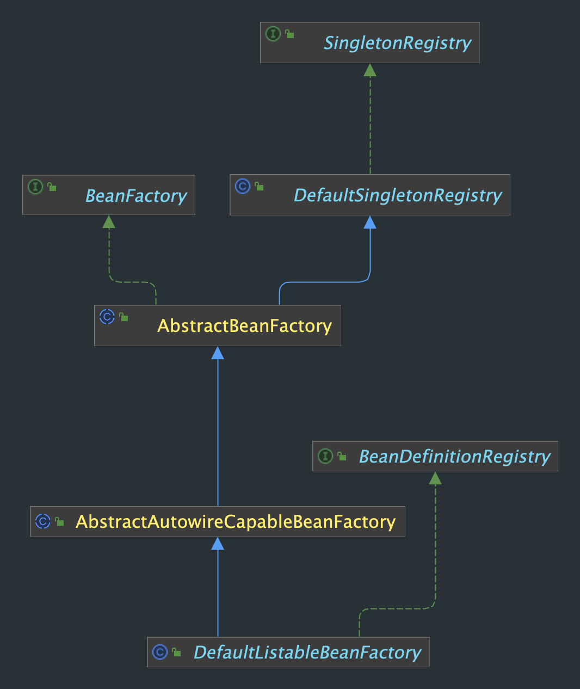

# My Spring

This is a tory project to simulate basic spring framework functionality.

## Core: IOC

### Factory



#### BeanFactory

`BeanFactory` is a root interface to access bean container. It is implemented by objects which hold a number of `beanDefinition`.

`beanDefinition` contains all the information that create a bean needed. Such as the type of bean (Singleton or independent) // FIX ME

```java
// get bean
Object getBean(String name) throws BeansException;
```

#### AbstractBeanFactory
I implement `BeanFactory` by `AbstractBeanFactory`, which also extends the `DefaultSingletonBeanRegister`,indicates 
that this has a singleton cache to provide shared instance. 

This is a base factory class implemented by beanFactory implementations that can obtain bean definition from some resources.

#### AbstractAutowiredCapableBeanFactory
Implement the AbstractBeanFactory.
- It can create a bean from bean definition (involves creation, populating properties, and initialization)
- It can also resolve bean reference

#### DefaultListableFactory

This factory is responsible for registering bean definition.
