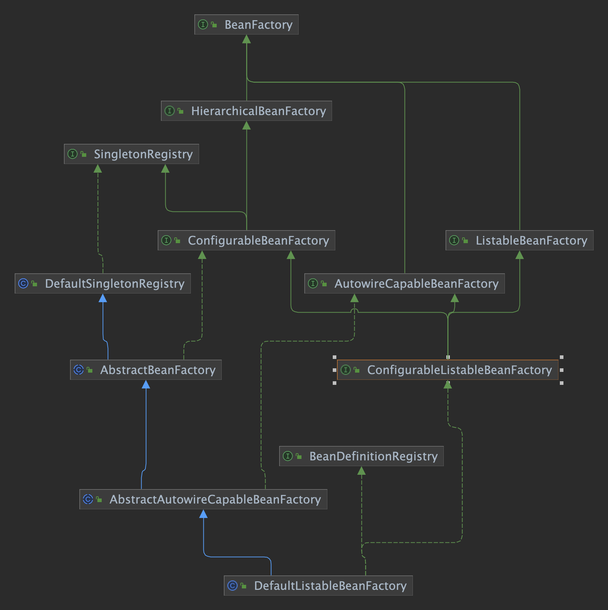
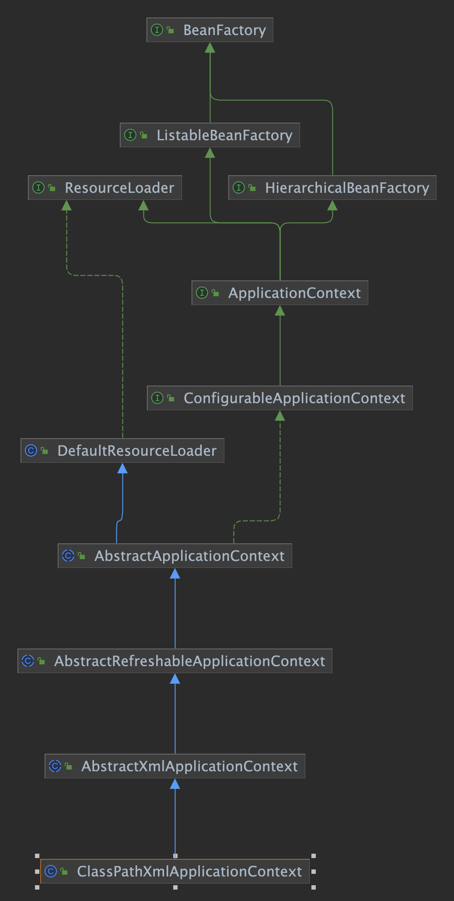
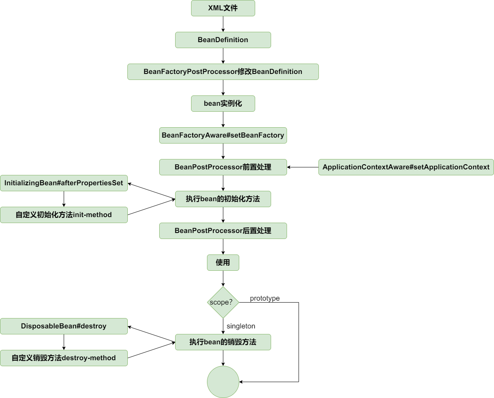

# My Spring

This is a tory project to simulate basic spring framework functionality.

## Core: IOC

[//]: # "### Factory"
[//]: #
[//]: # ""
[//]: #
[//]: # "#### BeanFactory"
[//]: #
[//]: # "`BeanFactory` is a root interface to access bean container. It is implemented by objects which hold a number of `beanDefinition`."
[//]: #
[//]: # "`beanDefinition` contains all the information that create a bean needed. Such as the type of bean (Singleton or independent) // FIX ME"
[//]: #
[//]: # "```java"
[//]: # "// get bean"
[//]: # "Object getBean(String name) throws BeansException;"
[//]: # "```"
[//]: #
[//]: # "#### AbstractBeanFactory"
[//]: # "I implement `BeanFactory` by `AbstractBeanFactory`, which also extends the `DefaultSingletonBeanRegister`,indicates "
[//]: # "that this has a singleton cache to provide shared instance. "
[//]: #
[//]: # "This is a base factory class implemented by beanFactory implementations that can obtain bean definition from some resources."
[//]: #
[//]: # "#### AbstractAutowiredCapableBeanFactory"
[//]: # "Implement the AbstractBeanFactory."
[//]: # "- It can create a bean from bean definition (involves creation, populating properties, and initialization)"
[//]: # "- It can also resolve bean reference"
[//]: #
[//]: # "#### BeanDefinitionRegistry "
[//]: #
[//]: # "Interface implemented by objects which can register bean definition. "
[//]: #
[//]: # "#### DefaultListableFactory"
[//]: #
[//]: # "This factory is responsible for registering bean definition and create bean from bean definition."
[//]: #



### BeanFactory

A bean container

### ListableBeanFactory

extension able to enumerate all defined beans

```java
public interface ListableBeanFactory extends BeanFactory {
    <T> Map<String, T> getBeansOfType(Class<T> type) throws BeansException;

    String[] getBeanDefinitionNames();
}
```

### AutowireCapableBeanFactory

extension able to autowire

also capable of applying bean postProcessor

### ConfigurableBeanFactory

Provides facilities to configure a bean factory

```java
public interface ConfigurableBeanFactory extends HierarchicalBeanFactory, SingletonRegistry {
    void addBeanPostProcessor(BeanPostProcessor beanPostProcessor);
}
```

### ConfigurableListableBeanFactory

In addition to ConfigurableBeanFactory, it provides facilities to analyze and modify bean definitions, and to pre-instantiate singletons.

```java
    void preInstantiateSingletons() throws BeansException;
```

### SingletonRegistry and Default SingletonRegistry

Interface: define a registry for shared beans

### AbstractBeanFactory

base class for BeanFactory implementation,
implements the `getBean` method

### AbstractAutowireCapableBeanFactory

implement the `createBean` method, using simple instantiation strategy default.

### BeanDefinitionRegistry

provide facilities to register bd.

```java
    void registerBeanDefinition(String beanName, BeanDefinition beanDefinition);

    BeanDefinition getBeanDefinition(String beanName);

    boolean containsBeanDefinition(String beanName);

    String[] getBeanDefinitionNames();
```



### ApplicationContext

the most difference between BeanFactory and ApplicationContext is:

**Bean Factory**

- Bean instantiation/wiring

**Application Context**

- Bean instantiation/wiring
- Load external configuration files like xml-based configuration
- Automatic BeanPostProcessor registration
- Automatic BeanFactoryPostProcessor registration

[//]: # "- Convenient MessageSource access (for i18n)"
[//]: # "- ApplicationEvent publication"

### ConfigurableApplicationContext

the SPI interface to be implemented by most if not all application contexts.

one of the implementations of **refresh**:

```java
@Override
    public void refresh() throws BeansException {
        // Tell the subclass to refresh the internal bean factory.
        refreshBeanFactory();
        ConfigurableListableBeanFactory beanFactory = getBeanFactory();

        // Before the bean factory is initialized,
        // let the post-processors apply any bean definitions they need.
        invokeBeanFactoryPostProcessors(beanFactory);

        // Register bean processors that intercept bean creation.
        registerBeanPostProcessors(beanFactory);

        // pre instantiate singletons
        beanFactory.preInstantiateSingletons();
    }
```

you can see that refresh method can create (or refresh) a beanFactory. And automatically invoke the BeanFactoryPostProcessors and register the bean processors.

### AbstractApplicationContext

Base class for ApplicationContext implementations.
Subclass need to implement the refreshBeanFactory() and getBeanFactory() methods.

### Aware interface

```java
/**
 * Marker superinterface indicating that a bean is eligible to be notified
 * by the Spring container of a particular framework object through a callback-style method.
 *
 * call back style method: like setBeanFactory(BeanFactory beanFactory), will be call by Spring Container
 * rather than the bean itself.
 */
public interface Aware {

}
```

We have two Aware interfaces:

- BeanFactoryAware

  - call back method: setBeanFactory(BeanFactory beanFactory)
  - timing: during the bean creatation

  ```java
    private Object initializeBean(String beanName, Object bean, BeanDefinition beanDefinition) {

        // automatically inject BeanFactory if the bean implements BeanFactoryAware
        if (bean instanceof BeanFactoryAware) {
            ((BeanFactoryAware) bean).setBeanFactory(this);
        }
    }
  ```

- ApplicationContextAware
  - call back method: setApplicationContext(ApplicationContext applicationContext)
  - timing: inject the ApplicationContext before the bean initialization by **beanPostProcessor**.
  ```java
  // Add a bean post-processor that can inject the ApplicationContext
  // into applicationContextAware beans.
  beanFactory.addBeanPostProcessor(new ApplicationContextAwareProcessor(this));
  ```

### Bean Life Cycle



There is no difference between afterPropertiesSet and init-method except the priority.

Only singleton beans need to be registered for destruction, this is beacause that:

- You don't have to do anything if the prototype bean is not used, it will be garbage collected.
- In contrast to the other scopes, Spring does not manage the complete lifecycle of a prototype bean.
- The client code must clean up prototype-scoped objects and release
  expensive resources that the prototype bean(s) are holding.

### FactoryBean

FactoryBean is a special bean that can be used to define the factory method for creating a bean.

Instead of registering the bean itself, you register the FactoryBean like this:

```xml
<beans>
  <bean class="org.zjj.myspring.ioc.common.CarFactoryBean" id="car">
    <property name="brand" value="porsche"></property>
  </bean>
</beans>
```

Then when we get the bean from the container, we will get the object created by the FactoryBean.

```java
if (beanInstance instanceof FactoryBean) {
    FactoryBean<?> factoryBean = (FactoryBean<?>) beanInstance;
    try {
        if (factoryBean.isSingleton()) {
            object = factoryBeanObjectCache.get(name);
            if (object == null) {
                object = factoryBean.getObject();
                factoryBeanObjectCache.put(name, object);
            }
        } else {
            object = factoryBean.getObject();
        }
    } catch (Exception e) {
        throw new BeansException("FactoryBean threw exception on object creation", e);
    }
}
return object;
```

There are two ways to get the object from the FactoryBean:

- If the bean is singleton, we will cache the object.
- If the bean is prototype, we will create a new object every time.

### Event and EventListener

To achieve that, we need:

1. applicationEventMulticaster

used to manage the EventListener and publish event on these listener, this will be initialized among the application refreshing.

2. EventListener beans

You can register eventlistener as beans.

## AOP

### Pointcut Expresion

define the pointcut expression to match the target method.

```java
AspectJExpressionPointcut pointcut = new AspectJExpressionPointcut("execution(* org.zjj.myspring.aop.service.*.*(..))");

// check if the class or method matches the pointcut
assertThat(pointcut.matches(clazz)).isTrue();
assertThat(pointcut.matches(method, clazz)).isTrue();
```

### JDK Dynamic Proxy

use JDK Dynamic Proxy to achieve AOP.

```java
@Override
public Object getProxy() {
    return Proxy.newProxyInstance(
        getClass().getClassLoader(),
        advisedSupport.getTargetSource().getTargetClass(),
        this
    );
}
// invoke method on proxy object
WorldService proxy = (WorldService) new JdkDynamicAopProxy(advisedSupport).getProxy();
proxy.explode();
```

After the proxy object is created, we can invoke the method on the proxy object.

Then the `invoke` method will be called, and we check if the method matches the pointcut.

```java
if (advisedSupport.getMethodMatcher().matches(method, advisedSupport.getTargetSource().getTargetClass().getClass())){
    // aop alliance method interceptor invoke
}
```

### Cglib Dynamic proxy

JDK Dynamic proxy can only proxy by interface
(so your target class needs to implement an interface, which is then also implemented by the proxy class).

CGLIB (and javassist) can create a proxy by subclassing.
In this scenario the proxy becomes a subclass of the target class. No need for interfaces.

CGLIB using a bytecode generation library to generate a subclass of the target class.
JdkDynamicAopProxy using Java reflection to create a proxy. Specifically, using a ClassLoader's defineClass() method to create a new class.

When using cglib, we need define a DynamicAdvisedInterceptor to intercept the method. This interceptor is not the same as the one intercept
aop alliance method interceptor. It is like a InvocationHandler in JDK Dynamic Proxy.

### ProxyFactory

proxyFactory provide a simple way to obtain proxy object.

rather than using

```java
WorldService proxy = (WorldService) new CglibAopProxy(advisedSupport).getProxy();
```

we can use:

```java
advisedSupport.setProxyTargetClass(true);
proxy = (WorldService) new ProxyFactory(advisedSupport).getProxy();
```

### Before Advice

This is similar to WorldServiceInterceptor class.

We first define a class implements MethodBeforeAdvice:

The before method just a callBack method, which will be called before the target method.

```java
public class WorldServiceBeforeAdvice implements MethodBeforeAdvice {

    @Override
    public void before(Method method, Object[] args, Object target) throws Throwable {
        System.out.println("WorldServiceBeforeAdvice: do something");
    }

}
```

Than we register this advice into the MethodBeforeAdviceInterceptor:

```java
WorldServiceBeforeAdvice beforeAdvice = new WorldServiceBeforeAdvice();
MethodBeforeAdviceInterceptor methodInterceptor = new MethodBeforeAdviceInterceptor(beforeAdvice);
```

This interceptor will be called if the pointcut matches.

It is important to note that the interceptor is also a Advice.
When the jointPoint is reached, the interceptor will be called:

```java
return methodInterceptor
            .invoke(/*...*/)
```

Simple advice like:

```java
public class WorldServiceInterceptor implements MethodInterceptor {

    @Override
    public Object invoke(MethodInvocation invocation) throws Throwable {
        System.out.println("WorldServiceInterceptor: before");
        Object result = invocation.proceed();
        System.out.println("WorldServiceInterceptor: after");
        return result;
    }

}
```

We can also have a more complex advice like MethodBeforeAdvice:

```java
public class WorldServiceBeforeAdvice implements MethodBeforeAdvice {
    @Override
    public void before(Method method, Object[] args, Object target) throws Throwable {
        System.out.println("WorldServiceBeforeAdvice: do something");
    }
}
WorldServiceBeforeAdvice beforeAdvice = new WorldServiceBeforeAdvice();
MethodBeforeAdviceInterceptor methodInterceptor = new MethodBeforeAdviceInterceptor(beforeAdvice);
```

This in fact is a advice in another advice. We wrapped beforeAdvice in BeforeAdviceInterceptor.

### Advisor

With Advisor, we can combine the pointcut and advice together.

```java
AspectJExpressionPointcutAdvisor advisor = new AspectJExpressionPointcutAdvisor();
advisor.setExpression(expression);
MethodBeforeAdviceInterceptor methodInterceptor = new MethodBeforeAdviceInterceptor(new WorldServiceBeforeAdvice());
advisor.setAdvice(methodInterceptor);
```

next time, we can get the interceptor by directly called `(MethodInterceptor)advisor.getAdvice()`
This can be a simple interceptor or a complex interceptor contains multiple advice.

### Auto-proxy

Even we have advisor, we still need to create proxy object manually.
like this:

```java
AdvisedSupport advisedSupport = new AdvisedSupport();
TargetSource targetSource = new TargetSource(worldService);
advisedSupport.setTargetSource(targetSource);
advisedSupport.setMethodInterceptor((MethodInterceptor) advisor.getAdvice());
advisedSupport.setMethodMatcher(advisor.getPointcut().getMethodMatcher());
//advisedSupport.setProxyTargetClass(true);   //JDK or CGLIB
WorldService proxy = (WorldService) new ProxyFactory(advisedSupport).getProxy();
```

But we can do this automatically by using BeanPostProcessor.

So we can create a BeanPostProcessor to create proxy object automatically.

```java
public interface InstantiationAwareBeanPostProcessor extends BeanPostProcessor {}

// implementation
public class DefaultAdvisorAutoProxyCreator implements
    InstantiationAwareBeanPostProcessor,
    BeanFactoryAware {}
```

This bean will be applied before bean creation(it is a special postProcessor, will may be cause a short-cut during bean creation),
and it will create a proxy object if the bean matches the pointcut:

```java
@Override
protected Object createBean(String beanName, BeanDefinition beanDefinition) {
    // give BeanPostProcessors a chance to return a proxy instead of the target bean instance
    Object bean = resolveBeforeInstantiation(beanName, beanDefinition);
    if (bean != null) {
        return bean;
    }
    return doCreateBean(beanName, beanDefinition);
}
```

After that, we can get the proxy object automatically as long as we define the postProcessor in the bean container.

```xml
<bean class="org.zjj.myspring.aop.framework.autoproxy.DefaultAdvisorAutoProxyCreator"></bean>
```

### Placeholder configurer

Placeholder configurer is a special BeanFactoryPostProcessor, which will replace the placeholder in the bean definition.
